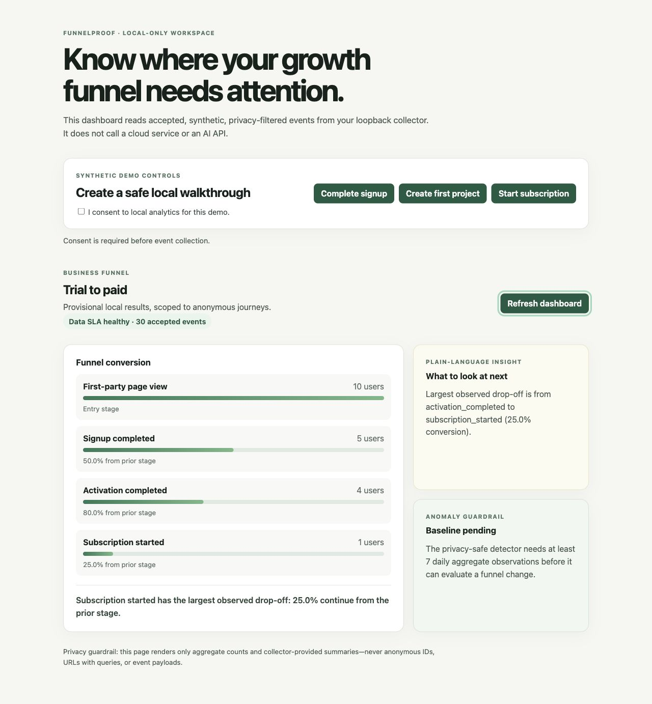

# FunnelProof

An open, privacy-first funnel-confidence service for independent B2B SaaS teams. FunnelProof helps a founder verify and understand the path from first visit to signup, activation, and paid subscription. The initial release targets SaaS websites and web apps; iOS follows using the same event contract.

## Design

Read the [business-first product and architecture design](docs/product-and-architecture-design.md).

## Starter implementation

The initial local-only vertical slice contains:

- `contracts/` — versioned event schema and the B2B SaaS tracking plan.
- `packages/web-sdk/` — privacy-first TypeScript SDK; it emits a minimal first-party `vpv` and explicit funnel events only after consent.
- `services/collector/` — Java 21 loopback collector with a Kafka-compatible local event-log boundary, idempotent workspace-scoped materialization, and a provisional funnel-insight endpoint.
- `apps/demo-saas/` — synthetic trial-to-paid walkthrough; it never sends real customer data.
- `tests/` — contract fixtures plus SDK and collector tests.

## Local dashboard demo

The demo app now includes a small business-owner dashboard: aggregate stage conversion, the data-freshness SLA, deterministic next-step commentary, and an explicitly gated anomaly status. It reads only the collector's workspace-scoped aggregate report; it never renders identifiers or event payloads.



The screenshot is generated from synthetic local events only: 10 page views, 5 signups, 4 activations, and 1 subscription. It is illustrative, not a customer metric or a production benchmark.

Seed a repeatable, privacy-safe dashboard scenario with `make demo-data`. The available scenarios include healthy conversion, signup drop-off, payment drop-off, late arrivals ordered by event time, stable-event retry/deduplication, and a subscription anomaly evaluated from daily aggregates. Details are in the [demo guide](apps/demo-saas/README.md#repeatable-synthetic-scenarios).

### First run (local and free)

After `npm install`, run the complete safe walkthrough:

```bash
make demo-start
make demo-data SCENARIO=healthy
make demo-check
```

Open [http://127.0.0.1:5173](http://127.0.0.1:5173) to see the dashboard. It starts a loopback-only collector and dashboard, stores only synthetic data under ignored `.funnel-proof/demo/`, and never creates a cloud resource. When finished, run `make demo-stop`.

To rebuild the aggregate-only Gold snapshot from that synthetic Silver data, run:

```bash
FUNNEL_PROOF_GOLD_INPUT_DIR=.funnel-proof/demo/events \
FUNNEL_PROOF_GOLD_OUTPUT=.funnel-proof/demo/gold/daily-funnel.v1.json \
make gold-backfill
```

## Local verification

Install the free runtimes described in the design's zero-cost execution policy, then run:

```bash
make doctor
npm install
make verify
```

No cloud account, paid API, container runtime, or real customer data is required.

The starter's local funnel report is intentionally marked **provisional**. It makes the privacy, event ordering, idempotency, and data-freshness decisions executable before we run the Kafka/Flink/Spark scale-out path described in the design. The collector uses a local durable event log by default and has an opt-in Apache Kafka producer adapter with the same topic/key contract; neither requires a cloud account.

The optional [local Kafka profile](infra/kafka/README.md) is pinned to a free Apache image and remains loopback-only. It is never started by the default verification or demo commands.

## Development cost

Development is local and zero-cost by default: no cloud resources, paid APIs, credit-card trials, or real customer data. See the design document's **Zero-cost execution policy** before running any project setup.
