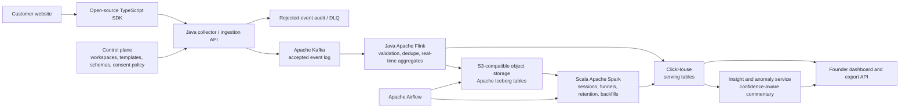

# FunnelProof: Verified Trial-to-Paid Funnel Design

**Status:** Draft 0.2 — B2B SaaS adoption pivot

**Primary audience:** Independent B2B SaaS founders and small product teams (roughly 1–20 developers)

**Initial channel:** A SaaS marketing site and web application; iOS follows only after the web onboarding proves demand.

## 1. Vision

FunnelProof gives an independent B2B SaaS owner a trustworthy answer to a simple business question:

> Where do prospective users drop out between their first visit, signup, product activation, and paid subscription?

The product makes that answer available without requiring the owner to design an event taxonomy, operate a data platform, or hire a data analyst. A team should be able to add a small web SDK, define what “activation” means for its product, confirm three critical events, and see a verified trial-to-paid funnel within an hour.

This is **not** a generic “capture every click” analytics product or a broad product-development suite. It is an end-to-end, privacy-aware **funnel-confidence service** centered on the few actions that determine a SaaS business outcome: acquisition, signup, activation, subscription, and return engagement.

## 2. Product goals

### Primary business outcomes

1. **Fast time to first answer.** A new workspace can see a populated core funnel in less than one hour after installation.
2. **Owner-readable metrics.** The default dashboard explains visits, stage-by-stage conversion, drop-off, and repeat engagement in plain business language.
3. **Guided SaaS onboarding.** The setup flow asks what activation means and supplies the required event calls rather than presenting a blank analytics workspace.
4. **Funnel confidence.** Funnel numbers are versioned, validated, privacy-filtered, reproducible from immutable source events, and visibly marked as verified or incomplete.
5. **Low operational burden.** Customers use a hosted endpoint; they do not need to run Kafka, Spark, Flink, Kubernetes, or Airflow.
6. **Open and portable.** The SDK, event schemas, documentation, and a self-host reference deployment are public. Customers can export their data and are not locked into a proprietary event format.

### Product principles

- **Business outcome before telemetry volume.** Instrument events that change a decision, not every possible UI interaction.
- **A narrow wedge before a platform.** Solve trial-to-paid for B2B SaaS before adding industries, channels, or broad analytics features.
- **Opinionated defaults, configurable escape hatches.** The SaaS tracking plan should work immediately and remain editable by a technical user.
- **Privacy is a product feature.** Collection is minimized, consent-aware, and protected before data reaches durable storage.
- **One source of metric truth.** Real-time views are useful, but historical Spark-built tables are the canonical source for business reporting.
- **Progressive complexity.** Basic setup must remain simple even though the hosted backend is built to scale.
- **Confidence before sophistication.** A user must know whether a funnel is complete and fresh before being asked to interpret it.

## 3. Users and jobs to be done

| User | Primary job | What success looks like |
|---|---|---|
| SaaS founder / owner | Understand whether trial users reach value and become paid | Can identify the largest trial-to-paid drop-off and act on it without SQL |
| Growth lead | Compare acquisition sources by activation and subscription | Can see which source produces activated or paying users, not only visits |
| Developer / agency | Instrument a SaaS product safely | Adds the SDK, verifies three critical events, and knows which properties are allowed |
| Data / privacy administrator | Control access, retention, and deletion | Can audit collection, export data, and fulfill deletion requests |

## 4. Scope

### V1: verified B2B SaaS trial-to-paid funnel

V1 supports a JavaScript/TypeScript SDK for a SaaS marketing site and web application. It provides consent-aware page views and a deliberate API for business events. It ships with one opinionated tracking plan:

`landing_viewed` → `signup_completed` → `activation_completed` → `subscription_started`

During onboarding, the founder chooses the activation action that represents first value in their product—for example, `first_project_created`, `first_report_shared`, or `first_invoice_sent`. The setup guide maps that action to `activation_completed` and supplies the exact integration call. The owner may label the funnel in business terms, while the underlying definition remains versioned so every historical chart states the rule used to calculate it.

### V1 positioning and differentiated value

The category already contains capable open-source and hosted tools for web analytics, product analytics, custom events, funnels, retention, and self-hosting. FunnelProof will not try to out-feature those platforms. Its initial promise is narrower:

> **Install three verified business events and know whether your SaaS trial converts to activation and paid subscription.**

The product differentiates through a guided activation-definition flow, generated copy-paste instrumentation, a test journey, and a visible funnel-confidence checklist. The checklist shows whether each required event has been received, is schema-valid, is fresh, and is reconciled with the canonical result. The dashboard starts with one decision—where the trial-to-paid journey breaks—rather than an empty chart builder.

### Explicitly out of scope for V1

- Native iOS SDK, session replay, heatmaps, and unrestricted DOM capture
- E-commerce, marketplace, lead-generation, and additional industry templates
- A full customer-data platform or marketing automation system
- Ad attribution beyond supplied campaign parameters
- Custom SQL authoring for business owners
- Machine-learning recommendations
- A customer-operated distributed cluster

The future iOS SDK and later industry templates must emit the same event envelope and use the same consent, schema, identity, and verification rules as V1.

## 5. Customer onboarding and funnel setup

The onboarding experience is part of the system design, not an afterthought.

1. **Create workspace.** The founder creates an organization and chooses a data region.
2. **Confirm the outcome.** The founder confirms that the tracked business outcome is a paid subscription.
3. **Define activation.** The onboarding guide asks for the first action that proves a trial user reached product value.
4. **Install the SDK.** The developer adds a single browser snippet and workspace key.
5. **Verify automatic collection.** The SDK reports the first page view and checks consent state.
6. **Add three critical events.** The setup guide shows the exact calls for signup, activation, and subscription.
7. **Run a test funnel.** A test-event mode verifies every stage, reports prohibited fields, and highlights missing instrumentation.
8. **Use the default dashboard.** The dashboard presents stage conversion, time between stages, drop-off, seven-day return engagement, and funnel-confidence status.

Example installation:

```ts
import { funnelProof } from "@funnel-proof/web";

funnelProof.init({
  workspaceKey: "fp_public_example",
  consent: "required"
});

funnelProof.track("activation_completed", {
  plan: "starter",
  activation_action: "first_project_created"
});
```

The developer must add business events at meaningful success points. FunnelProof does not infer activation from a click or subscription from a pricing-page visit.

## 6. Event contract and B2B SaaS tracking plan

Every accepted event uses a stable, versioned envelope. The event name identifies the business action; properties add only approved business context. Event names are lowercase `snake_case`, concise, past-tense business facts where possible, and never encode a UI component or a changing product detail.

### 6.1 Event primitives

| Primitive | Definition | Required fields beyond the common envelope | Use in a funnel |
|---|---|---|---|
| `vpv` | A **virtual page view** emitted through a first-party 1×1 pixel/beacon (`1Pxl`) or equivalent first-party SDK request when a route becomes viewable | `page_path` after query/fragment removal; `occurred_at`; `session_id` | Baseline acquisition and route-level context, not proof of business value |
| `click` | A user interaction with a registered UI component | `ui_name`; optional `ui_type`, `ui_surface` | Optional diagnostic or entry step; never substitute for a completed business outcome |
| `signup_completed` | Account creation completed successfully | Optional non-sensitive `signup_method` | Core V1 funnel step |
| `activation_completed` | The user completed the workspace's declared first-value action | `activation_action` from the registered activation catalog | Core V1 funnel step |
| `subscription_started` | A paid subscription successfully started | `plan`, `billing_interval` | Core V1 funnel step |

`vpv` is deliberately small. Its client timestamp is required in UTC with millisecond precision and must represent when the route became viewable, not when a batch flush occurred. The collector always adds authoritative `received_at` in UTC. If `occurred_at` is missing, malformed, implausibly far from `received_at`, or in the future beyond the permitted clock-skew window, the event is quarantined or assigned server time with an explicit `event_time_quality` flag; it is never silently treated as a clean client-time event.

`vpv` uses a first-party collection endpoint so the customer controls the domain under which the browser request is made. It stores a normalized route only: no URL query string, fragment, full referrer, page title, DOM content, or user-entered text. Tenant identity is derived from the workspace key and is not supplied as an untrusted client property.

### 6.2 Component filtering, not component-specific event names

`click` is a reusable primitive. Its `ui_name` is a registered, stable semantic identifier such as `pricing_cta`, `nav_signup`, or `create_project_button`; it is not visible button text and must not contain user input. The optional `ui_surface` identifies the route or product area, and `ui_type` identifies a stable component class such as `button` or `link`.

Funnel definitions express component-level breakdowns as predicates over the primitive. For example, “pricing CTA click” means `event_name = 'click' AND properties.ui_name = 'pricing_cta'`, not a separate `pricing_cta_clicked` event. This prevents event-name proliferation, makes UI variants filterable downstream, and keeps the core vocabulary intuitive. A conversion step still uses `signup_completed`, `activation_completed`, or `subscription_started`; a click alone cannot claim a conversion.

### 6.3 Common envelope

```json
{
  "event_id": "01J0...",
  "event_name": "subscription_started",
  "occurred_at": "2026-07-30T18:45:00.000Z",
  "received_at": "2026-07-30T18:45:01.019Z",
  "tenant_id": "workspace_123",
  "anonymous_id": "pseudonymous-browser-id",
  "user_id": "optional-pseudonymous-stable-id",
  "session_id": "session_456",
  "properties": {
    "plan": "pro",
    "billing_interval": "monthly",
    "acquisition_channel": "organic_search"
  },
  "context": {
    "platform": "web",
    "sdk_version": "1.0.0"
  },
  "schema_version": 1,
  "consent": {
    "analytics": true
  }
}
```

Reserved fields are controlled by the platform. Tenant-defined properties are approved through an event schema registry. The SaaS tracking plan declares its required stages, optional dimensions, and forbidden fields. It may allow `plan`, `billing_interval`, `acquisition_channel`, and registered UI metadata, but never an email address, payment identifier, access token, free-form text, customer content, URL query parameter, or DOM-derived value.

### 6.4 Compatibility and historical replay

The event envelope carries a required `schema_version`, `tracking_plan_version`, and `funnel_definition_version`. Additive optional fields are backward compatible. A field's type and meaning are immutable once published: a breaking change creates a new field, event, or version instead of reusing an existing name with a new meaning.

Readers are tolerant of unknown additive fields. Silver normalization includes versioned upcasters that convert prior compatible schema versions into the current typed representation, preserving the source version and transformation version for audit. Contract tests run in CI against current and prior fixture events before an SDK, collector, or transformation change can ship.

Canonical backfills always rebuild from immutable, privacy-filtered Bronze events with the relevant tracking-plan and funnel-definition versions. If a development/demo environment has no real history, it may generate a clearly labeled synthetic time series with trend, seasonality, and controlled anomalies. Synthetic rows carry `is_synthetic = true`, never mix with customer data, and never drive customer-facing recommendations.

## 7. Functional requirements

| Area | Requirement |
|---|---|
| Collection | Send a minimal first-party `vpv` only after consent and collect named business events through `track()` |
| Identity | Support anonymous browsing, optional pseudonymous user identity, session identity, and post-login identity stitching |
| Funnel definitions | Provide the versioned SaaS trial-to-paid funnel; allow an owner to label activation and technical users to extend it safely |
| Reporting | Show counts, conversion rate, median time to next stage, source breakdown, seven-day return engagement, confidence status, and a plain-language insight summary |
| Validation | Reject invalid event names, invalid property types, missing required fields, invalid event time, expired workspace keys, and disallowed properties |
| Compatibility | Preserve event, tracking-plan, and funnel-definition versions; support deterministic historical backfills from Bronze |
| Anomaly detection | Detect both business-metric changes and instrumentation/data-quality failures; never label an insight trustworthy when its input data is unhealthy |
| Data freshness | Surface ordinary events in the near-real-time view within five minutes; publish durable batch reporting on an hourly cadence and expose SLA status at every layer |
| Export | Export selected events and aggregates as CSV or Parquet through a documented API |
| Privacy controls | Enforce consent, data minimization, retention, access control, export, and deletion workflows |
| Reliability | Allow safe retry from clients and safe replay from Kafka without double-counting metrics |

## 8. Architecture overview

The product is a multi-tenant hosted service. The customer only integrates the SDK and uses the dashboard; distributed components are operated by FunnelProof.



### 8.1 Control plane

The control plane is a Java service backed by PostgreSQL. It owns workspaces, user roles, API keys, the B2B SaaS tracking plan, consent policy, event schemas, funnel versions, retention settings, data-service objectives, and data-subject requests. It is authoritative for tenant configuration; event processors receive a versioned, cached projection of the configuration.

### 8.2 Web SDK

The public TypeScript SDK is small, versioned, and framework-neutral. It queues events while the page is active, batches requests, retries with bounded backoff, and attaches the current consent and schema version. It generates a UUID/ULID-style `event_id` client-side so retries do not create new logical events.

The SDK sends no analytics event before consent when the workspace is configured to require it. It never records keystrokes, form values, page DOM, full query strings, fragments, raw referrers, passwords, payment data, user-generated content, or session replay by default. It does not inspect the DOM to infer clicks; developers explicitly register a stable `ui_name` when a `click` primitive is useful.

### 8.3 Collector and ingestion API

The Java collector is stateless and horizontally scalable on Kubernetes. It authenticates the workspace key, enforces per-tenant rate limits, applies the latest schema and privacy policy, validates event time, rejects prohibited fields, assigns `received_at`, and writes only accepted events to Kafka. No pre-filtered event payload is persisted for debugging.

Requests receive a bounded acknowledgement after Kafka accepts the record. Invalid events return an actionable error for development mode; production clients receive a safe response while a sanitized reason is recorded for the workspace's event-quality page.

### 8.4 Kafka

Kafka is the durable, replayable event log. A topic is partitioned by a stable key such as `tenant_id + anonymous_id` so events for a browser remain ordered while tenants scale across partitions. Retention is long enough to support recovery and replay into Iceberg; Kafka is not the long-term analytics store.

The collector uses idempotent production. Consumers maintain offsets through their processing/checkpoint mechanism. Partition count, retention, lag, and consumer health are operational metrics.

### 8.5 Flink streaming path

A Java Flink job consumes accepted events from Kafka. It performs low-latency enrichment from versioned workspace configuration, event-time handling, bounded deduplication by `tenant_id + event_id`, and writes curated events to Iceberg. It also creates provisional near-real-time counters in ClickHouse.

Flink uses event-time watermarks. Events that arrive after the configured lateness window are retained in the lake and included by Spark in the canonical historical result; the dashboard can label a live metric as provisional until the hourly batch has completed.

### 8.6 Lakehouse storage

S3 is the production object store. MinIO provides a compatible local-development and self-host option. Apache Iceberg provides table-level schema evolution, atomic commits, partition pruning, snapshots, and time travel.

| Layer | Contents | Purpose |
|---|---|---|
| Bronze | Accepted, privacy-filtered immutable events with source versions | Replay, audit, reproducibility, and deterministic backfills |
| Silver | Typed events, identities, sessions, and validated dimensions | Reusable analytical source tables |
| Gold | Funnel stages, conversion, retention, and business aggregates | Canonical business metrics |

Tables are partitioned to match access patterns, typically by event date and tenant bucket. The implementation avoids excessive tiny files through scheduled compaction.

### 8.7 Spark batch path

Scala Spark jobs create the canonical Silver and Gold layers. Spark performs identity stitching, sessionization, late-event correction, backfills, funnel computations, retention cohorts, quality checks, and Iceberg compaction.

The transformations should model business logic as small pure Scala functions around immutable case classes. `Either` expresses validation outcomes; `Option` expresses genuinely optional values; I/O, time, and configuration are kept at the edge of each job. This makes funnel rules testable independently of a Spark cluster.

Spark execution is tuned with partition pruning, predicate pushdown, appropriate shuffle partitioning, adaptive query execution, broadcast joins for small template/configuration tables, and skew monitoring. Caching is applied only when a measured reuse case justifies its memory cost.

### 8.8 Airflow

Airflow orchestrates the batch path rather than processing events directly. DAGs schedule hourly and daily transformations, data-quality checks, compaction, backfills, retention work, deletion workflows, and publication of canonical Gold tables. DAG runs are partition-aware, idempotent, observable, and safe to retry.

### 8.9 Serving layer

ClickHouse is the MPP analytical serving database. It exposes precomputed funnel and engagement tables through a tenant-isolated dashboard/API. Users should not query raw lake data for ordinary product reporting.

The dashboard compares provisional streaming counts with the last canonical batch result internally; the canonical result is the source for exported reports and billing-sensitive metrics.

### 8.10 Insight and anomaly service

The dashboard does not stop at charts. It translates the canonical funnel into a short decision-oriented view: what changed, where it changed, the comparison window, data confidence, and the next diagnostic to check. The first implementation is deterministic commentary over approved aggregates; for example, “activation conversion is 18% below its four-week weekday baseline, while signup volume and data freshness are healthy.”

Anomaly detection starts with robust, explainable baselines: a rolling history segmented by weekday where enough history exists, median and median absolute deviation rather than a fragile mean alone, minimum-volume thresholds, and separate checks for event volume, stage conversion, and pipeline freshness. The service distinguishes likely business anomalies from data anomalies. A sudden fall in `activation_completed` alongside an ingestion-SLA breach is an instrumentation/data incident, not a product-conversion conclusion.

AI-generated commentary is optional and may only consume tenant-isolated aggregate metrics, approved definitions, confidence status, and anomaly evidence—never raw events, identifiers, or sensitive properties. It must cite the time window and metric behind each statement, avoid causal claims it cannot prove, and be suppressed whenever a required data SLA is unhealthy. The local zero-cost profile uses deterministic commentary only; it does not call a paid model API.

### 8.11 Development execution boundary

The architecture above is a target design, **not** an instruction to provision cloud infrastructure. During development, FunnelProof runs locally against synthetic data. S3 is represented by MinIO; Kafka, Flink, Spark, Airflow, PostgreSQL, and ClickHouse are optional local containers, not managed services. Kubernetes is a design and later local-learning concern, not a V1 deployment requirement.

## 9. Reliability, correctness, and operations

### Delivery and duplicate handling

End-to-end “exactly once” is not assumed. Browser networks retry, Kafka can replay, and batch work can rerun. The design achieves **effectively-once metrics** through the stable `event_id`, idempotent Kafka production, stateful stream deduplication, unique merge semantics in curated tables, and idempotent Airflow partitions.

### Data quality

Data quality is enforced, not merely observed, at three boundaries:

1. The SDK validates developer-facing event calls where possible.
2. The collector enforces schema and privacy policy before durable storage.
3. Spark validates volume, freshness, null rates, stage ordering, duplicates, and reconciliation between Bronze, Silver, and Gold.

Every rejected or quarantined event is attributable to a workspace and a safe reason code. No sensitive rejected payload is stored solely for debugging. A failed quality gate blocks publication of the affected canonical Gold partition rather than publishing a number known to be incomplete.

### Data SLA enforcement at every layer

The product exposes a per-workspace data-health status, not a single opaque uptime number. A metric is considered **trusted** only when the required layers are healthy for its time window. Initial objectives are below; local development measures the same contracts without claiming an external availability guarantee.

| Layer | Contract / initial objective | Enforcement when unhealthy |
|---|---|---|
| SDK / `1Pxl` | No analytics emission before required consent; required envelope fields and valid client event time before enqueue | Block invalid local events, surface developer error in test mode, and record a privacy-safe counter |
| Collector | Valid event is schema/privacy checked and durably acknowledged or rejected with a reason; `received_at` is always assigned | Reject or quarantine before Kafka; rate-limit abuse; alert on reject-rate or acknowledgement-latency breach |
| Kafka | Accepted event is available to consumers in order within its partition; consumer lag remains under the live-view budget | Alert on lag/under-replication; pause confidence publication rather than present stale live data as current |
| Flink / Iceberg Bronze | Accepted event reaches a committed raw snapshot and provisional aggregate within five minutes at P95 | Restore from checkpoint, replay offsets, and mark live metrics delayed until catch-up completes |
| Spark / Airflow Gold | Hourly canonical funnel completes with all quality gates and a visible data-through timestamp | Retry idempotent partition; retain prior canonical snapshot; mark the affected window stale and suppress insight claims |
| ClickHouse / dashboard | Dashboard serves the identified canonical snapshot and shows its freshness in every funnel view | Roll back to last healthy snapshot; display stale status rather than a partially published result |
| Insight / anomaly service | Commentary and alerts use healthy, sufficient-volume aggregate inputs and name their comparison window | Suppress commentary/alerts or label them data-quality incidents when confidence prerequisites fail |

SLA rules are versioned data contracts. Airflow evaluates them after each materialization; the control plane stores the result, and the dashboard displays it. Alerts are routed first as an operational data incident—collection, freshness, or quality—before any product-conversion interpretation is made.

### Observability

OpenTelemetry traces the SDK request path through the collector. Platform metrics include request error rate, rate-limit events, Kafka lag, Flink checkpoint duration/failure, Iceberg commit errors, Spark task skew, Airflow SLA misses, ClickHouse query latency, and data freshness per tenant.

An event's lineage can be followed from `event_id` to Kafka offset, Iceberg snapshot, batch run, and Gold-table version.

### Kubernetes deployment

The hosted system runs on Kubernetes with separate autoscaling policies for collector pods, Flink task managers, Spark executors, Airflow workers, and ClickHouse. Resource requests and limits are tuned from observed CPU, memory, lag, checkpoint, and shuffle metrics—not shared blindly across workloads.

## 10. Privacy and security guardrails

Privacy controls apply before data lands in the lake. A first-party endpoint improves domain control and resilience; it does **not** remove the need for consent or a lawful collection policy.

- **Default deny event contract:** every field is classified before publication. Only allowlisted low-sensitivity fields are accepted; free-form text, arbitrary JSON, customer content, URL query parameters, DOM-derived values, email addresses, payment identifiers, and secrets are rejected.
- **Data minimization at the edge:** the SDK sends normalized route paths only. The collector discards raw IP address after the minimum security/rate-limit processing needed by policy and does not retain a pre-redaction payload.
- **Consent twice:** the SDK gates emission, and the collector enforces the workspace consent policy again. Consent withdrawal stops future collection and starts the appropriate deletion/suppression workflow.
- **Pseudonymous identity:** analytics identifiers are pseudonymous. Identity mappings are encrypted, access-restricted, separated from funnel aggregates, and never exposed through the owner dashboard.
- **Tenant isolation:** encryption in transit and at rest, role-based access, audit logs, tenant-scoped serving queries, and storage access policies prevent one workspace from reading another's data.
- **Retention and deletion:** retention is configured by data class. A verified deletion request creates a durable marker, removes applicable identity-linked Bronze/Silver/serving rows, rebuilds affected Gold partitions, and preserves only compliance-safe audit evidence.
- **Privacy regression tests:** SDK, collector, schema, and export tests include prohibited-field fixtures. A release that emits or accepts a forbidden field fails its quality gate.
- **Portability:** a customer can export its approved events and aggregates in documented formats without exporting another tenant's data or internal security metadata.

## 11. Public and self-hosting posture

The public project should publish the TypeScript SDK, event contract, B2B SaaS tracking plan, documentation, example site, and a reference deployment under the Apache-2.0 license. This supports adoption and makes integration behavior inspectable.

The hosted offering is a future option, not a development dependency. It would operate the distributed pipeline and provide managed retention, observability, backup, support, and organization controls. The initial self-host reference uses a local container runtime such as Colima or Podman, plus the SDK, collector, PostgreSQL, and ClickHouse. It preserves the same event contract but does not require a small business to operate Kafka, Flink, Spark, or Kubernetes.

## 12. Zero-cost execution policy

FunnelProof is developed under a **zero-cost-by-default** rule. No action taken for this project may create a bill, require a credit card, start a paid trial, or provision a managed cloud resource without explicit approval that names the expected cost, spending cap, and shutdown plan.

### Allowed now

- Public GitHub repository, local Git commits, and public documentation
- OpenJDK/Java, Scala, Python, Node.js, and TypeScript tooling
- Local development using free/open-source software: PostgreSQL, ClickHouse, MinIO, Apache Kafka, Apache Flink, Apache Spark, and Apache Airflow
- Local containers through a free local runtime such as Colima or Podman
- Synthetic test events and local dashboards

### Explicitly not allowed now

- AWS, GCP, Azure, Databricks, Confluent Cloud, managed Kubernetes, or a paid database
- A cloud object-storage bucket, managed Kafka cluster, hosted Airflow, or any paid API
- Entering a credit card, accepting a paid trial, or deploying infrastructure through Terraform or a cloud console
- Collecting real customer data before a privacy policy, consent flow, and an approved operating plan exist

### Execution profiles

| Profile | What runs | Cost policy |
|---|---|---|
| Starter — execute first | Sample SaaS site, TypeScript SDK, Java collector, PostgreSQL or ClickHouse, and synthetic funnel events | Entirely local; no cloud account |
| Distributed learning — optional | Local Kafka, Flink, Spark, MinIO, and Airflow to exercise the target architecture | Entirely local; use only when the starter flow works |
| Hosted beta — deferred | Multi-tenant cloud deployment for real external users | Requires a separate written cost plan and explicit approval before any provisioning |

The only practical cost of the first two profiles is use of the developer's existing computer, local disk, and electricity. Every command and setup guide should state which profile it belongs to.

## 13. Success metrics and service objectives

| Metric | Initial target |
|---|---|
| Time from workspace creation to first verified event | Under 15 minutes |
| Time to first verified trial-to-paid funnel | Under 60 minutes |
| Accepted event availability in live view | P95 under 5 minutes |
| Canonical Gold-table freshness | Hourly, with visible last-success timestamp |
| Funnel confidence | Every required stage shows received, schema-valid, fresh, and reconciled status |
| Event schema rejection visibility | Actionable reason visible within 5 minutes |
| Data export availability | Customer-selectable dates and documented CSV/Parquet formats |

The most important product metric is not total events ingested. It is the percentage of active workspaces with a verified trial-to-paid funnel that a founder returns to use each week.

## 14. Delivery plan

### Phase 0 — product contract

- Publish the event envelope, privacy policy, and one B2B SaaS tracking plan.
- Define the founder dashboard wireframe and the exact trial-to-paid questions it answers.
- Build a sample B2B SaaS website that emits the required critical events.

### Phase 1 — vertical slice

- TypeScript SDK with consent gate, page view, `track()`, batching, and test mode.
- Java collector with workspace key validation, schema validation, and local PostgreSQL or ClickHouse storage.
- Minimal dashboard with a setup checklist, first verified event, and a funnel-confidence indicator.
- Run only synthetic data on a local machine; do not provision any external service.

### Phase 2 — durable analytical truth

- Local MinIO-backed Iceberg tables.
- Local Kafka/Flink plus Scala Spark Silver/Gold jobs for sessions, canonical funnel results, and seven-day retention.
- Local Airflow orchestration, backfills, data-quality gates, and reconciliation.

### Phase 3 — beta hardening and cost decision

- Tenant management, RBAC, retention, export, and deletion workflow in the self-host reference.
- Local load tests, failure-recovery exercises, and public implementation documentation.
- Write a cloud cost plan; seek explicit approval before any hosted deployment, managed service, or real-user beta.

## 15. Key trade-offs

| Decision | Chosen approach | Why |
|---|---|---|
| First adopter | Independent B2B SaaS teams | A common trial-to-paid journey allows a focused onboarding flow and avoids competing as generic web analytics |
| First client platform | Web | Faster installation and iteration than a native iOS SDK |
| Event capture model | Explicit critical events plus automatic page views | Preserves privacy and business meaning |
| Stream and batch | Flink for provisional real time; Spark for canonical batch | Matches latency needs without allowing two ungoverned metric definitions |
| Lake storage | Iceberg on S3-compatible storage | Supports evolution, replay, reproducibility, and portability |
| Serving database | ClickHouse | Fast analytical queries and accessible self-host path |
| Customer deployment | Hosted by default, lightweight self-host option | Small businesses receive value without operating a data platform |
| Development cost | Local-first with synthetic data | Builds the product without a cloud bill or credit card |
| Open posture | Apache-2.0 SDK and public schemas/docs | Builds trust and reduces adoption friction |

## 16. Open design questions

1. Which founder-described action should the guided activation-definition flow accept in V1, and how should it map to the canonical event?
2. What is the first retention default: 7-day return engagement or a template-specific window after activation?
3. Which cloud and data-residency region should the hosted beta support first?
4. Should the first dashboard be read-only for founders, or include a guided activation-step editor from the start?
5. What free-tier event and retention limits keep evaluation useful without making platform cost unpredictable?
6. What evidence from the first ten design-partner conversations would justify adding a second industry template?

## 17. Operational design decisions

### Why Kafka only guarantees ordering within a partition

Kafka is a topic made of multiple independent append-only logs called partitions. Each partition assigns an increasing offset to the records it accepts, so consumers observe a durable order **within that partition**. Kafka does not establish a global order across partitions: doing so would require cross-broker coordination for every write and would eliminate the horizontal throughput that partitions provide.

The producer hashes the record key to select a partition. The key therefore makes a correctness and scaling trade-off:

| Key choice | Benefit | Risk |
|---|---|---|
| `tenant_id` | All of one tenant's events are ordered together and tenant-level reads are simple | A large tenant creates a hot partition and limits that tenant to one partition's write/consume throughput |
| `user_id` | Events for a known user remain ordered and user state is simple to update | Pre-login users may not have a user ID; one user can still be hot; changing identity after login can move later events to a different partition |
| `tenant_id + stable_tracking_id` | Preserves order for one anonymous browser/session while distributing a tenant's users across partitions | Does not create total order for every user across devices; identity stitching must happen downstream |

For FunnelProof, the default key is `tenant_id + stable_tracking_id`, where the tracking ID exists before login and stays stable across the browser journey. A `user_id` is added as a property after identification, rather than replacing the Kafka key mid-session. Cross-device ordering is resolved from event time during Silver processing; it should not be inferred from the interleaving of Kafka partitions. Kafka partitioning is not a tenant-security boundary—authorization and storage policy provide isolation.

### Why exactly once is an end-to-end design issue

“Exactly once” cannot be claimed merely because a Kafka producer or a Flink job has an exactly-once setting. Duplicates can originate at every boundary: a browser retries after an acknowledgement is lost, the collector retries a publish, a stream task fails after sending to a sink but before checkpoint completion, a downstream database times out after accepting a write, or an Airflow task is rerun.

The design uses a stable `event_id` created by the SDK and preserved unchanged through every retry. It then composes several protections:

1. The collector uses idempotent Kafka production.
2. Flink snapshots source offsets and keyed dedupe state in a checkpoint; with a transactional sink, offsets and output commit together.
3. Iceberg writes are published atomically as table snapshots.
4. ClickHouse and batch sinks use idempotent upsert/merge semantics keyed by tenant and event ID where raw events are stored.
5. Spark jobs deduplicate by the same durable key and write a deterministic partition/version, so a retry does not inflate Gold metrics.

The resulting promise is **effectively-once business metrics**, not a blanket assertion that every network call in every external system is exactly once. Dedupe state has a retention limit, so historical batch reconciliation remains the final protection for duplicates that arrive after a streaming state TTL expires.

### Event time, processing time, watermarks, and late funnel events

`occurred_at` is **event time**: when the customer action happened on the device. `received_at` is **processing time**: when the platform observed it. They differ because of mobile/offline buffering, browser retries, network delay, queue lag, and recovery replay.

Funnel order and time-to-convert use event time. If activation completed at 10:00 but reached the collector at 10:08, the business funnel must count it after the preceding 09:59 signup rather than according to receive order.

Flink maintains a watermark: a moving assertion that events earlier than a threshold are unlikely to arrive. For example, a watermark based on the maximum observed event time minus a two-hour lateness allowance lets a window wait for ordinary delays without holding state forever. Events earlier than that watermark are late:

- Events inside the allowed lateness window can update the provisional stream aggregate.
- Events outside it are retained in Iceberg with a late-event indicator rather than silently discarded.
- The hourly Spark job recomputes affected Silver/Gold date partitions from immutable events and atomically publishes a corrected canonical funnel result.

The dashboard labels live values as provisional and shows the canonical batch timestamp. A funnel definition is versioned, so corrections do not rewrite history under a different business rule.

### Spark optimization decisions

Spark tuning begins with the query plan and measured file/shuffle statistics, not with a fixed list of configuration values.

- **Partition sizing:** target reasonably large Parquet/Iceberg files—often roughly 128–512 MiB depending on workload—and choose input/shuffle partition counts that keep tasks long enough to amortize scheduling but short enough to balance. Observe task duration, spilled bytes, and executor utilization before tuning.
- **Skew:** identify hot tenants, campaigns, empty/default keys, and join keys that dominate a shuffle. Filter invalid keys early; pre-aggregate where correctness allows; split or salt only the known hot key; and isolate an exceptionally large tenant if necessary. Salting must be paired with a correct aggregation/join strategy.
- **Broadcast joins:** broadcast only genuinely small, bounded tables such as active funnel definitions or workspace policy. It avoids a large shuffle, but broadcasting an unbounded identity or event table risks executor memory failure.
- **Adaptive Query Execution:** enable AQE so Spark can coalesce post-shuffle partitions, split detected skewed partitions, and select a more appropriate join strategy from observed statistics. AQE complements good data layout; it does not fix an unbounded cross join or a bad key.
- **Shuffle reduction:** select only required columns, filter and aggregate before joins, use Spark SQL built-ins instead of Python/Scala UDFs when possible, avoid repeated `repartition`, and avoid a global sort unless a consumer needs it.
- **Iceberg layout:** partition by event day and a bounded tenant bucket, then compact small files. Do not partition by high-cardinality user ID or event ID. Hidden partition transforms and sort order should serve frequent tenant-and-time range queries.
- **Caching:** cache only an expensive, reused intermediate that is consumed by multiple actions in the same application. A single-use DataFrame cache consumes memory, may cause eviction/spill, and does not remove the underlying shuffle. Unpersist deliberately after reuse.

### Streaming failure recovery, replay, and backfills

Flink consumes Kafka offsets as part of checkpointed source state. A completed checkpoint records the source offsets, keyed operator state such as the dedupe map, and coordinated sink state. On failure, Flink restores the latest completed checkpoint and resumes from those offsets. Records after the checkpoint can be reprocessed, which is why sink idempotency is still required.

Transient failures use bounded retries and backoff. A malformed or policy-violating record goes to a privacy-safe dead-letter topic with a reason code, schema version, event ID, and replayable sanitized payload. A DLQ is not a trash can: it has owners, alerting, retention, correction tooling, and a controlled route to replay after the underlying schema/configuration issue is fixed. An infrastructure outage should not be immediately routed to a DLQ.

For a controlled replay, operators use a separate consumer group or reset approved offsets, write to a staging/versioned Iceberg result, validate counts and quality checks, and then publish the replacement snapshot. Backfills use Bronze Iceberg events and the relevant version of transformation and funnel definition; they do not depend on Kafka retaining every historical event. This protects current serving tables from accidental duplicate replay.

### Privacy deletion and corrected aggregates

The platform maintains an access-restricted identity-to-data index. It maps a pseudonymous identity key to event IDs and affected table/date partitions; the key is protected like personal data and is not exposed to ordinary analytics users.

On a verified deletion request, the control plane first writes a durable deletion marker and suppresses new tracking for that identity where policy requires. The deletion workflow then:

1. Removes identity mappings and applicable records from Bronze/Silver Iceberg tables using targeted equality/delete files and compaction for physical removal.
2. Removes corresponding rows from ClickHouse serving tables and excludes the identity from any in-flight stream result.
3. Rebuilds the affected Gold partitions from the remaining Silver data, publishing corrected aggregates atomically.
4. Records completion and scope in a compliance-safe audit trail without retaining the deleted payload.

Raw data is already privacy-filtered, but a pseudonymous identifier can still be personal data under many regimes; it must be included in deletion and retention design. Deletion SLAs, backup expiry, and the exact legal basis are policy decisions documented separately with privacy counsel.

### Kubernetes scaling by workload type

The collector/API is stateless. Kubernetes Horizontal Pod Autoscaling can increase collector replicas using CPU, request rate, concurrency, and p95 latency signals, while a load balancer spreads requests. Pods have explicit resource requests/limits, disruption budgets, and separate node capacity from batch workloads.

Kafka/Flink consumers have a different constraint: useful stream parallelism cannot exceed available Kafka partitions. Flink state also must be repartitioned safely. Scaling is performed through the Flink Kubernetes Operator/autoscaler or an explicit savepoint-and-rescale procedure, monitored by lag, checkpoint duration, backpressure, and state size—not ordinary API-style HPA alone.

Spark is batch-oriented and is tuned separately. Each job declares executor CPU, memory, shuffle/storage overhead, and maximum parallelism; dynamic allocation can adjust executors when the scheduler and shuffle design support it. Large backfills run in quotas or dedicated node pools so they do not starve ingestion. Namespace quotas, priority classes, node pools/taints, and workload-specific autoscaling prevent an API traffic burst, a streaming checkpoint, and a Spark shuffle from competing unpredictably for the same resources.
