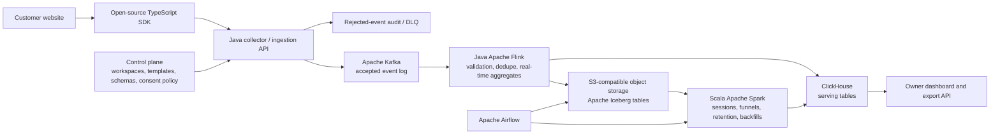

# One Click Data: Business-First Product and Architecture Design

**Status:** Draft 0.1  
**Primary audience:** Small-business owners and the developers who support them  
**Initial channel:** Websites; iOS follows after the web product proves its onboarding and funnel model.

## 1. Vision

One Click Data gives a small-business owner a trustworthy answer to a simple business question:

> Where are prospective customers dropping out between first visit and the action that makes the business money?

The product makes that answer available without requiring the owner to design an event taxonomy, operate a data platform, or hire a data analyst. A business should be able to add a small web SDK, select an industry-specific funnel template, confirm its critical actions, and see a funnel within an hour.

This is **not** a generic “capture every click” analytics product. It is an end-to-end, privacy-aware funnel service centered on the small set of user actions that represent the business journey: acquisition, signup or intent, activation, checkout or conversion, and repeat engagement.

## 2. Product goals

### Primary business outcomes

1. **Fast time to first answer.** A new workspace can see a populated core funnel in less than one hour after installation.
2. **Owner-readable metrics.** The default dashboard explains visits, stage-by-stage conversion, drop-off, and repeat engagement in plain business language.
3. **Industry-specific onboarding.** The setup flow offers a clear starting template rather than a blank event-definition screen.
4. **Trustworthy data.** Funnel numbers are versioned, validated, privacy-filtered, and reproducible from immutable source events.
5. **Low operational burden.** Customers use a hosted endpoint; they do not need to run Kafka, Spark, Flink, Kubernetes, or Airflow.
6. **Open and portable.** The SDK, event schemas, documentation, and a self-host reference deployment are public. Customers can export their data and are not locked into a proprietary event format.

### Product principles

- **Business outcome before telemetry volume.** Instrument events that change a decision, not every possible UI interaction.
- **Opinionated defaults, configurable escape hatches.** Templates should work immediately and remain editable by a technical user.
- **Privacy is a product feature.** Collection is minimized, consent-aware, and protected before data reaches durable storage.
- **One source of metric truth.** Real-time views are useful, but historical Spark-built tables are the canonical source for business reporting.
- **Progressive complexity.** Basic setup must remain simple even though the hosted backend is built to scale.

## 3. Users and jobs to be done

| User | Primary job | What success looks like |
|---|---|---|
| Business owner | Understand whether the core customer journey converts | Can identify the largest drop-off and act on it without SQL |
| Growth / marketing lead | Compare traffic sources and campaigns | Can see which source produces activated or paying users, not only visits |
| Developer / agency | Instrument a customer site safely | Adds the SDK, verifies a few events, and knows which properties are allowed |
| Data / privacy administrator | Control access, retention, and deletion | Can audit collection, export data, and fulfill deletion requests |

## 4. Scope

### V1: web core funnels

V1 supports a JavaScript/TypeScript SDK for websites. It provides automatic page views and a deliberate API for business events. The product includes templates for the following core journeys:

| Industry template | Default funnel |
|---|---|
| B2B SaaS | `landing_viewed` → `signup_completed` → `activation_completed` → `subscription_started` |
| E-commerce | `product_viewed` → `cart_updated` → `checkout_started` → `purchase_completed` |
| Marketplace / lead generation | `landing_viewed` → `lead_submitted` → `qualified_lead` → `booking_or_purchase_completed` |

An owner selects one template during onboarding, labels it in business terms, and can add or remove steps. Funnel definitions are versioned so a historical chart always states the definition used to calculate it.

### Explicitly out of scope for V1

- Native iOS SDK, session replay, heatmaps, and unrestricted DOM capture
- A full customer-data platform or marketing automation system
- Ad attribution beyond supplied campaign parameters
- Custom SQL authoring for business owners
- Machine-learning recommendations
- A customer-operated distributed cluster

The future iOS SDK must emit the same event envelope and use the same consent, schema, and identity rules as the web SDK.

## 5. Customer onboarding and funnel setup

The onboarding experience is part of the system design, not an afterthought.

1. **Create workspace.** The owner creates an organization, chooses a data region, and selects an industry template.
2. **Confirm the outcome.** The owner names the business outcome, for example “paid subscription” or “completed purchase.”
3. **Install the SDK.** The developer adds a single browser snippet and workspace key.
4. **Verify automatic collection.** The SDK reports the first page view and checks consent state.
5. **Add critical events.** The setup guide shows the exact `track()` calls required for the chosen template.
6. **Run a test funnel.** A test-event mode verifies that every stage is received and that prohibited data was rejected.
7. **Use the default dashboard.** The dashboard presents stage conversion, time between stages, drop-off, and seven-day return engagement.

Example installation:

```ts
import { oneClickData } from "@one-click-data/web";

oneClickData.init({
  workspaceKey: "ocd_public_example",
  consent: "required"
});

oneClickData.track("signup_completed", {
  plan: "starter",
  acquisition_channel: "organic_search"
});
```

The developer must add business events at meaningful success points. One Click Data does not infer a purchase from a button click.

## 6. Event contract and industry templates

Every accepted event uses a stable, versioned envelope. The event name identifies the business action; properties add only approved business context.

```json
{
  "event_id": "01J0...",
  "event_name": "purchase_completed",
  "occurred_at": "2026-07-30T18:45:00.000Z",
  "received_at": "2026-07-30T18:45:01.019Z",
  "tenant_id": "workspace_123",
  "anonymous_id": "pseudonymous-browser-id",
  "user_id": "optional-pseudonymous-stable-id",
  "session_id": "session_456",
  "properties": {
    "amount_cents": 2900,
    "currency": "USD",
    "product_tier": "pro"
  },
  "context": {
    "platform": "web",
    "sdk_version": "1.0.0"
  },
  "schema_version": 1,
  "consent": {
    "analytics": true
  }
}
```

Reserved fields are controlled by the platform. Tenant-defined properties are approved through an event schema registry. A template declares required stages, optional dimensions, and forbidden fields. For example, the e-commerce template may allow `currency` and `amount_cents`, but never a full card number, email address, postal address, or free-form checkout note.

Schema evolution uses additive changes when possible. Breaking changes create a new event or schema version and require an explicit migration in the control plane.

## 7. Functional requirements

| Area | Requirement |
|---|---|
| Collection | Send page views automatically after consent and collect named business events through `track()` |
| Identity | Support anonymous browsing, optional pseudonymous user identity, session identity, and post-login identity stitching |
| Funnel definitions | Allow an owner to select, name, version, activate, and retire a funnel definition |
| Reporting | Show counts, conversion rate, median time to next stage, source breakdown, and seven-day return engagement |
| Validation | Reject invalid event names, invalid property types, missing required fields, expired workspace keys, and disallowed properties |
| Data freshness | Surface ordinary events in the near-real-time view within five minutes; publish durable batch reporting on an hourly cadence |
| Export | Export selected events and aggregates as CSV or Parquet through a documented API |
| Privacy controls | Enforce consent, data minimization, retention, access control, export, and deletion workflows |
| Reliability | Allow safe retry from clients and safe replay from Kafka without double-counting metrics |

## 8. Architecture overview

The product is a multi-tenant hosted service. The customer only integrates the SDK and uses the dashboard; distributed components are operated by One Click Data.



### 8.1 Control plane

The control plane is a Java service backed by PostgreSQL. It owns workspaces, user roles, API keys, industry templates, consent policy, event schemas, funnel versions, retention settings, and data-subject requests. It is authoritative for tenant configuration; event processors receive a versioned, cached projection of the configuration.

### 8.2 Web SDK

The public TypeScript SDK is small, versioned, and framework-neutral. It queues events while the page is active, batches requests, retries with bounded backoff, and attaches the current consent and schema version. It generates a UUID/ULID-style `event_id` client-side so retries do not create new logical events.

The SDK sends no analytics event before consent when the workspace is configured to require it. It never records keystrokes, form values, page DOM, full query strings, passwords, payment data, or session replay by default.

### 8.3 Collector and ingestion API

The Java collector is stateless and horizontally scalable on Kubernetes. It authenticates the workspace key, enforces per-tenant rate limits, applies the latest schema and privacy policy, removes prohibited fields, assigns `received_at`, and writes only accepted events to Kafka.

Requests receive a bounded acknowledgement after Kafka accepts the record. Invalid events return an actionable error for development mode; production clients receive a safe response while a sanitized reason is recorded for the workspace's event-quality page.

### 8.4 Kafka

Kafka is the durable, replayable event log. A topic is partitioned by a stable key such as `tenant_id + anonymous_id` so events for a browser remain ordered while tenants scale across partitions. Retention is long enough to support recovery and replay into Iceberg; Kafka is not the long-term analytics store.

The collector uses idempotent production. Consumers maintain offsets through their processing/checkpoint mechanism. Partition count, retention, lag, and consumer health are operational metrics.

### 8.5 Flink streaming path

A Java Flink job consumes accepted events from Kafka. It performs low-latency enrichment from versioned workspace configuration, event-time handling, bounded deduplication by `tenant_id + event_id`, and writes curated events to Iceberg. It also creates provisional near-real-time counters in ClickHouse.

Flink uses event-time watermarks. Events that arrive after the configured lateness window are retained in the lake and included by Spark in the canonical historical result; the dashboard can label a live metric as provisional until the hourly batch has completed.

### 8.6 Lakehouse storage

S3 is the production object store. MinIO provides a compatible local-development and self-host option. Apache Iceberg provides table-level schema evolution, atomic commits, partition pruning, snapshots, and time travel.

| Layer | Contents | Purpose |
|---|---|---|
| Bronze | Accepted, privacy-filtered immutable events | Replay, audit, and reproducibility |
| Silver | Typed events, identities, sessions, and validated dimensions | Reusable analytical source tables |
| Gold | Funnel stages, conversion, retention, and business aggregates | Canonical business metrics |

Tables are partitioned to match access patterns, typically by event date and tenant bucket. The implementation avoids excessive tiny files through scheduled compaction.

### 8.7 Spark batch path

Scala Spark jobs create the canonical Silver and Gold layers. Spark performs identity stitching, sessionization, late-event correction, backfills, funnel computations, retention cohorts, quality checks, and Iceberg compaction.

The transformations should model business logic as small pure Scala functions around immutable case classes. `Either` expresses validation outcomes; `Option` expresses genuinely optional values; I/O, time, and configuration are kept at the edge of each job. This makes funnel rules testable independently of a Spark cluster.

Spark execution is tuned with partition pruning, predicate pushdown, appropriate shuffle partitioning, adaptive query execution, broadcast joins for small template/configuration tables, and skew monitoring. Caching is applied only when a measured reuse case justifies its memory cost.

### 8.8 Airflow

Airflow orchestrates the batch path rather than processing events directly. DAGs schedule hourly and daily transformations, data-quality checks, compaction, backfills, retention work, deletion workflows, and publication of canonical Gold tables. DAG runs are partition-aware, idempotent, observable, and safe to retry.

### 8.9 Serving layer

ClickHouse is the MPP analytical serving database. It exposes precomputed funnel and engagement tables through a tenant-isolated dashboard/API. Users should not query raw lake data for ordinary product reporting.

The dashboard compares provisional streaming counts with the last canonical batch result internally; the canonical result is the source for exported reports and billing-sensitive metrics.

## 9. Reliability, correctness, and operations

### Delivery and duplicate handling

End-to-end “exactly once” is not assumed. Browser networks retry, Kafka can replay, and batch work can rerun. The design achieves **effectively-once metrics** through the stable `event_id`, idempotent Kafka production, stateful stream deduplication, unique merge semantics in curated tables, and idempotent Airflow partitions.

### Data quality

Data quality is evaluated at three boundaries:

1. The SDK validates developer-facing event calls where possible.
2. The collector enforces schema and privacy policy before durable storage.
3. Spark validates volume, freshness, null rates, stage ordering, duplicates, and reconciliation between Bronze, Silver, and Gold.

Every rejected event is attributable to a workspace and a safe reason code. No sensitive rejected payload is stored solely for debugging.

### Observability

OpenTelemetry traces the SDK request path through the collector. Platform metrics include request error rate, rate-limit events, Kafka lag, Flink checkpoint duration/failure, Iceberg commit errors, Spark task skew, Airflow SLA misses, ClickHouse query latency, and data freshness per tenant.

An event's lineage can be followed from `event_id` to Kafka offset, Iceberg snapshot, batch run, and Gold-table version.

### Kubernetes deployment

The hosted system runs on Kubernetes with separate autoscaling policies for collector pods, Flink task managers, Spark executors, Airflow workers, and ClickHouse. Resource requests and limits are tuned from observed CPU, memory, lag, checkpoint, and shuffle metrics—not shared blindly across workloads.

## 10. Privacy and security guardrails

Privacy controls apply before data lands in the lake.

- Consent state is checked in the SDK and enforced again at ingestion.
- Allowlisted schemas reject unexpected personal data; free-form text properties are disabled by default.
- Analytics identifiers are pseudonymous. Any identity mapping is access-restricted and separated from funnel aggregates.
- Data is encrypted in transit and at rest. Tenant access uses role-based authorization and audit logs.
- Tenant data is logically isolated in all serving queries and storage access policies.
- Configurable retention removes raw events on schedule; aggregate retention follows a documented policy.
- Deletion requests create a durable request record, remove or anonymize matching identity-linked records, rebuild affected Gold partitions, and preserve only compliance-safe audit evidence.
- A customer can export its events and aggregates in documented formats.

## 11. Public and self-hosting posture

The public project should publish the TypeScript SDK, event contract, template definitions, documentation, example site, and a reference deployment under the Apache-2.0 license. This supports adoption and makes integration behavior inspectable.

The hosted offering operates the distributed pipeline and can provide managed retention, observability, backup, support, and organization controls. A lightweight self-host reference uses Docker Compose with the SDK, collector, PostgreSQL, and ClickHouse for evaluation and low-volume use. It preserves the same event contract but does not require a small business to operate Kafka, Flink, Spark, or Kubernetes.

## 12. Success metrics and service objectives

| Metric | Initial target |
|---|---|
| Time from workspace creation to first verified event | Under 15 minutes |
| Time to first usable template funnel | Under 60 minutes |
| Accepted event availability in live view | P95 under 5 minutes |
| Canonical Gold-table freshness | Hourly, with visible last-success timestamp |
| Funnel reconciliation | Provisional-to-canonical delta monitored per tenant |
| Event schema rejection visibility | Actionable reason visible within 5 minutes |
| Data export availability | Customer-selectable dates and documented CSV/Parquet formats |

The most important product metric is not total events ingested. It is the percentage of active workspaces with a verified, owner-used core funnel.

## 13. Delivery plan

### Phase 0 — product contract

- Publish the event envelope, privacy policy, and three industry templates.
- Define the owner dashboard wireframe and the exact funnel questions it answers.
- Build a sample B2B SaaS website that emits the required critical events.

### Phase 1 — vertical slice

- TypeScript SDK with consent gate, page view, `track()`, batching, and test mode.
- Java collector with workspace key validation, schema validation, and Kafka production.
- Kafka → Java Flink → ClickHouse path for a live three-step funnel.
- Minimal dashboard with a setup checklist and first verified event.

### Phase 2 — durable analytical truth

- Iceberg tables on S3-compatible storage.
- Scala Spark Silver/Gold jobs for sessions, canonical funnel results, and seven-day retention.
- Airflow orchestration, backfills, data-quality gates, and reconciliation.

### Phase 3 — beta hardening

- Tenant management, RBAC, retention, export, and deletion workflow.
- Kubernetes deployment, dashboards, alerting, load tests, and failure-recovery exercises.
- Self-host Docker Compose reference and public implementation documentation.

## 14. Key trade-offs

| Decision | Chosen approach | Why |
|---|---|---|
| First client platform | Web | Faster installation and iteration than a native iOS SDK |
| Event capture model | Explicit critical events plus automatic page views | Preserves privacy and business meaning |
| Stream and batch | Flink for provisional real time; Spark for canonical batch | Matches latency needs without allowing two ungoverned metric definitions |
| Lake storage | Iceberg on S3-compatible storage | Supports evolution, replay, reproducibility, and portability |
| Serving database | ClickHouse | Fast analytical queries and accessible self-host path |
| Customer deployment | Hosted by default, lightweight self-host option | Small businesses receive value without operating a data platform |
| Open posture | Apache-2.0 SDK and public schemas/docs | Builds trust and reduces adoption friction |

## 15. Open design questions

1. Which industry receives the first polished template: B2B SaaS or e-commerce?
2. What is the first retention default: 7-day return engagement, 30-day repeat purchase, or template-specific behavior?
3. Which cloud and data-residency region should the hosted beta support first?
4. Should the first dashboard be read-only for owners, or include a guided funnel editor from the start?
5. What free-tier event and retention limits keep evaluation useful without making platform cost unpredictable?

## 16. Operational design notes and interview answers

### Why Kafka only guarantees ordering within a partition

Kafka is a topic made of multiple independent append-only logs called partitions. Each partition assigns an increasing offset to the records it accepts, so consumers observe a durable order **within that partition**. Kafka does not establish a global order across partitions: doing so would require cross-broker coordination for every write and would eliminate the horizontal throughput that partitions provide.

The producer hashes the record key to select a partition. The key therefore makes a correctness and scaling trade-off:

| Key choice | Benefit | Risk |
|---|---|---|
| `tenant_id` | All of one tenant's events are ordered together and tenant-level reads are simple | A large tenant creates a hot partition and limits that tenant to one partition's write/consume throughput |
| `user_id` | Events for a known user remain ordered and user state is simple to update | Pre-login users may not have a user ID; one user can still be hot; changing identity after login can move later events to a different partition |
| `tenant_id + stable_tracking_id` | Preserves order for one anonymous browser/session while distributing a tenant's users across partitions | Does not create total order for every user across devices; identity stitching must happen downstream |

For One Click Data, the default key is `tenant_id + stable_tracking_id`, where the tracking ID exists before login and stays stable across the browser journey. A `user_id` is added as a property after identification, rather than replacing the Kafka key mid-session. Cross-device ordering is resolved from event time during Silver processing; it should not be inferred from the interleaving of Kafka partitions. Kafka partitioning is not a tenant-security boundary—authorization and storage policy provide isolation.

### Why exactly once is an end-to-end design issue

“Exactly once” cannot be claimed merely because a Kafka producer or a Flink job has an exactly-once setting. Duplicates can originate at every boundary: a browser retries after an acknowledgement is lost, the collector retries a publish, a stream task fails after sending to a sink but before checkpoint completion, a downstream database times out after accepting a write, or an Airflow task is rerun.

The design uses a stable `event_id` created by the SDK and preserved unchanged through every retry. It then composes several protections:

1. The collector uses idempotent Kafka production.
2. Flink snapshots source offsets and keyed dedupe state in a checkpoint; with a transactional sink, offsets and output commit together.
3. Iceberg writes are published atomically as table snapshots.
4. ClickHouse and batch sinks use idempotent upsert/merge semantics keyed by tenant and event ID where raw events are stored.
5. Spark jobs deduplicate by the same durable key and write a deterministic partition/version, so a retry does not inflate Gold metrics.

The resulting promise is **effectively-once business metrics**, not a blanket assertion that every network call in every external system is exactly once. Dedupe state has a retention limit, so historical batch reconciliation remains the final protection for duplicates that arrive after a streaming state TTL expires.

### Event time, processing time, watermarks, and late funnel events

`occurred_at` is **event time**: when the customer action happened on the device. `received_at` is **processing time**: when the platform observed it. They differ because of mobile/offline buffering, browser retries, network delay, queue lag, and recovery replay.

Funnel order and time-to-convert use event time. If checkout happened at 10:00 but reached the collector at 10:08, the business funnel must count it after the preceding 09:59 cart action rather than according to receive order.

Flink maintains a watermark: a moving assertion that events earlier than a threshold are unlikely to arrive. For example, a watermark based on the maximum observed event time minus a two-hour lateness allowance lets a window wait for ordinary delays without holding state forever. Events earlier than that watermark are late:

- Events inside the allowed lateness window can update the provisional stream aggregate.
- Events outside it are retained in Iceberg with a late-event indicator rather than silently discarded.
- The hourly Spark job recomputes affected Silver/Gold date partitions from immutable events and atomically publishes a corrected canonical funnel result.

The dashboard labels live values as provisional and shows the canonical batch timestamp. A funnel definition is versioned, so corrections do not rewrite history under a different business rule.

### Spark optimization decisions

Spark tuning begins with the query plan and measured file/shuffle statistics, not with a fixed list of configuration values.

- **Partition sizing:** target reasonably large Parquet/Iceberg files—often roughly 128–512 MiB depending on workload—and choose input/shuffle partition counts that keep tasks long enough to amortize scheduling but short enough to balance. Observe task duration, spilled bytes, and executor utilization before tuning.
- **Skew:** identify hot tenants, campaigns, empty/default keys, and join keys that dominate a shuffle. Filter invalid keys early; pre-aggregate where correctness allows; split or salt only the known hot key; and isolate an exceptionally large tenant if necessary. Salting must be paired with a correct aggregation/join strategy.
- **Broadcast joins:** broadcast only genuinely small, bounded tables such as active funnel definitions or workspace policy. It avoids a large shuffle, but broadcasting an unbounded identity or event table risks executor memory failure.
- **Adaptive Query Execution:** enable AQE so Spark can coalesce post-shuffle partitions, split detected skewed partitions, and select a more appropriate join strategy from observed statistics. AQE complements good data layout; it does not fix an unbounded cross join or a bad key.
- **Shuffle reduction:** select only required columns, filter and aggregate before joins, use Spark SQL built-ins instead of Python/Scala UDFs when possible, avoid repeated `repartition`, and avoid a global sort unless a consumer needs it.
- **Iceberg layout:** partition by event day and a bounded tenant bucket, then compact small files. Do not partition by high-cardinality user ID or event ID. Hidden partition transforms and sort order should serve frequent tenant-and-time range queries.
- **Caching:** cache only an expensive, reused intermediate that is consumed by multiple actions in the same application. A single-use DataFrame cache consumes memory, may cause eviction/spill, and does not remove the underlying shuffle. Unpersist deliberately after reuse.

### Streaming failure recovery, replay, and backfills

Flink consumes Kafka offsets as part of checkpointed source state. A completed checkpoint records the source offsets, keyed operator state such as the dedupe map, and coordinated sink state. On failure, Flink restores the latest completed checkpoint and resumes from those offsets. Records after the checkpoint can be reprocessed, which is why sink idempotency is still required.

Transient failures use bounded retries and backoff. A malformed or policy-violating record goes to a privacy-safe dead-letter topic with a reason code, schema version, event ID, and replayable sanitized payload. A DLQ is not a trash can: it has owners, alerting, retention, correction tooling, and a controlled route to replay after the underlying schema/configuration issue is fixed. An infrastructure outage should not be immediately routed to a DLQ.

For a controlled replay, operators use a separate consumer group or reset approved offsets, write to a staging/versioned Iceberg result, validate counts and quality checks, and then publish the replacement snapshot. Backfills use Bronze Iceberg events and the relevant version of transformation and funnel definition; they do not depend on Kafka retaining every historical event. This protects current serving tables from accidental duplicate replay.

### Privacy deletion and corrected aggregates

The platform maintains an access-restricted identity-to-data index. It maps a pseudonymous identity key to event IDs and affected table/date partitions; the key is protected like personal data and is not exposed to ordinary analytics users.

On a verified deletion request, the control plane first writes a durable deletion marker and suppresses new tracking for that identity where policy requires. The deletion workflow then:

1. Removes identity mappings and applicable records from Bronze/Silver Iceberg tables using targeted equality/delete files and compaction for physical removal.
2. Removes corresponding rows from ClickHouse serving tables and excludes the identity from any in-flight stream result.
3. Rebuilds the affected Gold partitions from the remaining Silver data, publishing corrected aggregates atomically.
4. Records completion and scope in a compliance-safe audit trail without retaining the deleted payload.

Raw data is already privacy-filtered, but a pseudonymous identifier can still be personal data under many regimes; it must be included in deletion and retention design. Deletion SLAs, backup expiry, and the exact legal basis are policy decisions documented separately with privacy counsel.

### Kubernetes scaling by workload type

The collector/API is stateless. Kubernetes Horizontal Pod Autoscaling can increase collector replicas using CPU, request rate, concurrency, and p95 latency signals, while a load balancer spreads requests. Pods have explicit resource requests/limits, disruption budgets, and separate node capacity from batch workloads.

Kafka/Flink consumers have a different constraint: useful stream parallelism cannot exceed available Kafka partitions. Flink state also must be repartitioned safely. Scaling is performed through the Flink Kubernetes Operator/autoscaler or an explicit savepoint-and-rescale procedure, monitored by lag, checkpoint duration, backpressure, and state size—not ordinary API-style HPA alone.

Spark is batch-oriented and is tuned separately. Each job declares executor CPU, memory, shuffle/storage overhead, and maximum parallelism; dynamic allocation can adjust executors when the scheduler and shuffle design support it. Large backfills run in quotas or dedicated node pools so they do not starve ingestion. Namespace quotas, priority classes, node pools/taints, and workload-specific autoscaling prevent an API traffic burst, a streaming checkpoint, and a Spark shuffle from competing unpredictably for the same resources.

## 17. Interview discussion points

This project is deliberately shaped to demonstrate production data-engineering judgment: Java ingestion and streaming, Scala/Spark batch processing, Kafka/Flink/Spark semantics, S3/Iceberg lakehouse design, Airflow orchestration, ClickHouse serving, Kubernetes operations, and privacy-aware multi-tenancy.

It should be discussed honestly as a production-shaped design and implementation project, not as a substitute for years of operating a system at a prior employer. The strongest evidence will be benchmarks, failure-recovery tests, data-quality checks, documented trade-offs, and a working end-to-end vertical slice.
